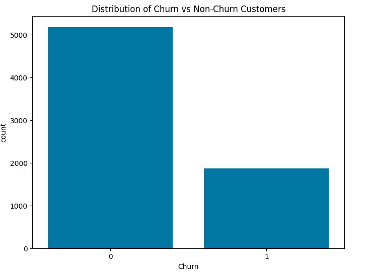
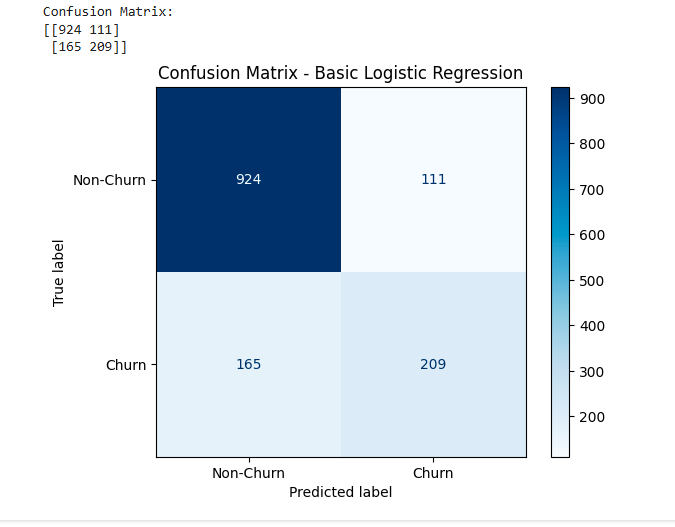
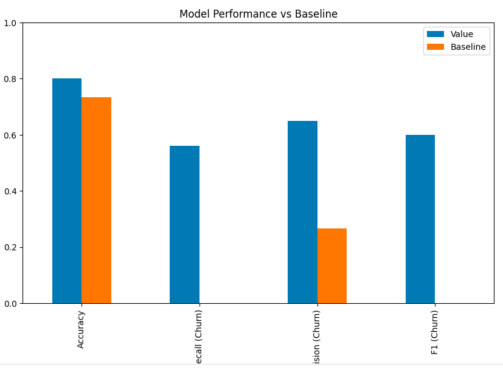
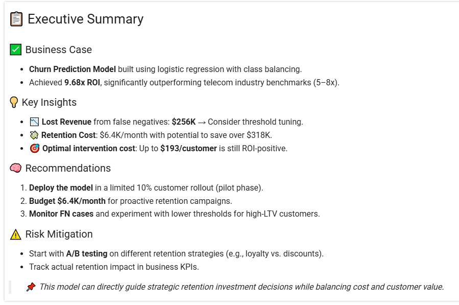

# 📊 Telecom Churn Prediction Model

This project builds a machine learning model to predict telecom customer churn and help the business optimize retention strategies based on cost-benefit analysis.

---

## 📁 Project Files

- `telecom_churn_model.ipynb` – Full end-to-end notebook with EDA, preprocessing, modeling, evaluation, and business recommendations.
- `processed_churn_data.csv` – Cleaned dataset used in model training.
- `images/` – Visuals used for results summary and GitHub display.

---

## 🧠 Problem Statement

Churn is expensive. This model helps a telecom provider:
- Predict which customers are likely to leave.
- Identify the **ROI** of retention campaigns.
- Focus retention efforts where they provide the most value.

---

## 🧪 Model Summary

- **Algorithm:** Logistic Regression with class weighting
- **Target Variable:** `Churn` (Yes/No)
- **Evaluation Metrics:** Precision, Recall, F1-Score
- **Strategy:** Cost-benefit analysis based on TN, FP, FN, TP

---

## 📈 Key Visuals

### 📊 ROI Breakdown

> For every \$1 spent, \$9.68 is saved — based on churn predictions and retention impact.

---

### 📉 Churn Distribution

> Target variable is imbalanced; class weighting was applied during model training.

---

### 🧮 Confusion Matrix

> Most churners are correctly identified, though some are still missed (false negatives).

---

### 🧪 Model Evaluation Metrics

> Shows good precision and recall on minority class after rebalancing.

---

### 📋 Executive Summary

> ROI exceeds industry benchmarks. Deployment and testing strategy recommended.

---

## ✅ Business Recommendations

- Deploy to 10% of customers to validate assumptions.
- Budget ~$6.4K/month for retention campaigns.
- Optimize threshold for high-LTV customers.

---

## 🚀 Author

- **Essam T.**  
  Senior Software Developer | AI & Data Enthusiast  
  Languages: English | Arabic | French  
  🇨🇦 Based in Egypt (Canadian Citizen)

---

